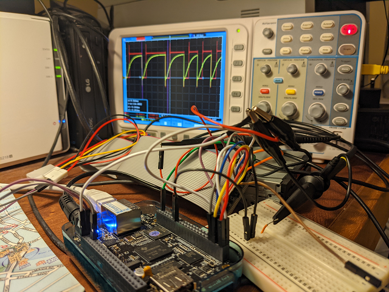
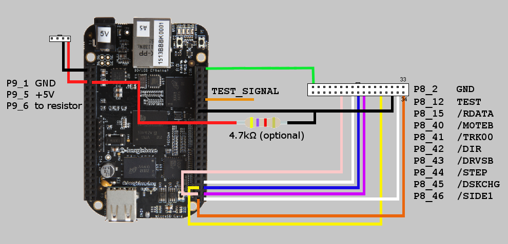
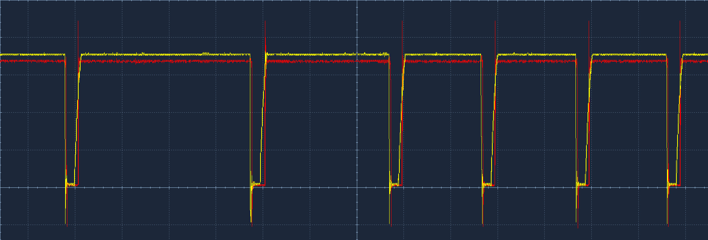
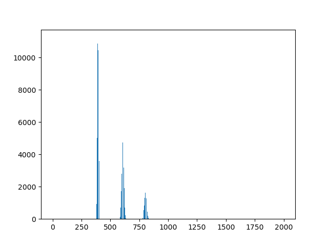
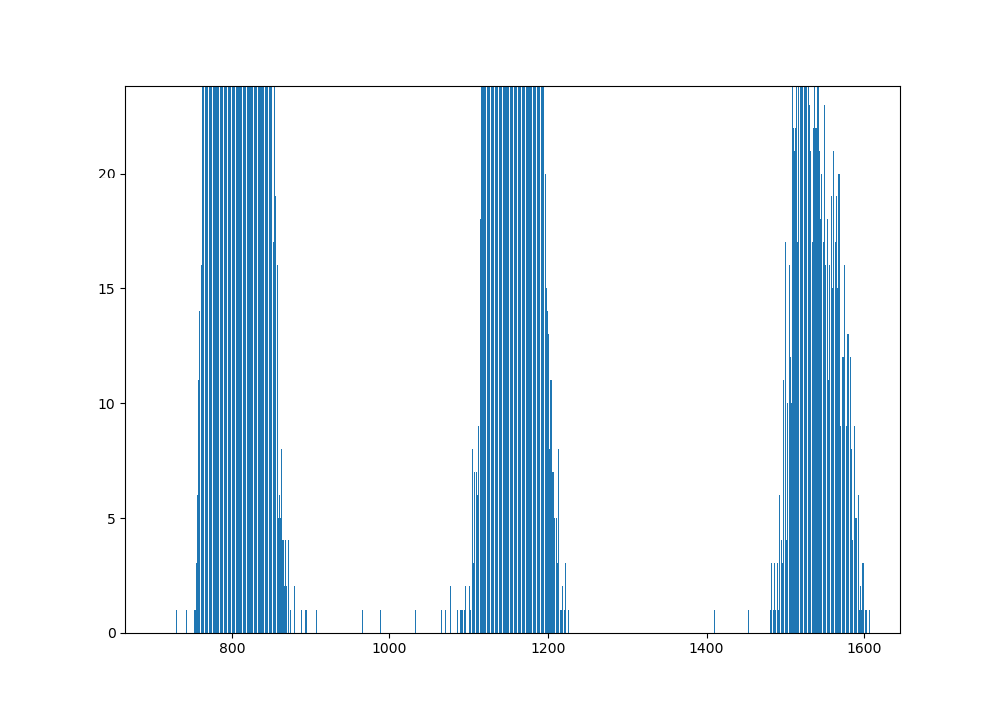

# ADF

ADF is short for Amiga Disk Format and it is also the name of this utility/project. This project uses BeagleBone Black (BBB) and PC floppy drive to scrape bits of your old Amiga 3.5'' diskettes.

The inspiration for this project comes from Robert Smith's [DrawBridge](https://amiga.robsmithdev.co.uk/instructions). If you need plug-and play user-friendly hardware Robert has solution for you. If forensics are necessary to rescue your precious content of your old Amiga floppy disks and/or you are interested in signal processing then I hope you will find this project interesting.

## Bill Of Materials (BOM)

- BeagleBone Black
- [3.5'' floppy drive](https://www.amazon.ca/gp/product/B01M4FX9K4/ref=ppx_yo_dt_b_asin_title_o04_s00?ie=UTF8&psc=1)
- [IDC Socket Extension Flat Ribbon Cable, 34-pin](https://www.amazon.ca/gp/product/B00X77H74K/ref=ppx_yo_dt_b_asin_title_o03_s00?ie=UTF8&psc=1)
- [One 5.25 Inch to Two 3.5 Inch Internal Power Y-Cable](https://www.amazon.ca/gp/product/B0002J1KW6/ref=ppx_yo_dt_b_asin_image_o02_s00?ie=UTF8&psc=1)
- Power supply, 5V, at least 2.5A with the plug that matches BeagleBone Black power input (it will provide power for both BBB and the floppy drive)
- jumper wires
- optional: 4.7kOhm resistor (if you want to be able to read HD disks)
- optional: scope (100 MHz bandwidth will suffice, if you would like to do signal level debugging)
- optional: breadboard

You don't have to use ribbon cable nor power cable but I find it easier to hook up everything with them.



As you can se in the picture I did a great job by the book. Of course, the circuit rings like church bell on Sunday morning but given that the signals are within 10 MHz range this has no effect on final result.

## Schematics


For pinout please refer to:

- [BeagleBone Black pinout](https://vadl.github.io/beagleboneblack/2016/07/29/setting-up-bbb-gpio)
- [Floppy Drive Pinout](http://rtfm.vtt.net/pinouts/data/InternalDisk_pinout.shtml.htm)

### Software Prerequisites

In order to build and run the code you need to use this BeagleBone Black debian image: [AM3358 Debian 10.3 2020-04-06 4GB](https://debian.beagleboard.org/images/bone-eMMC-flasher-debian-10.3-iot-armhf-2020-04-06-4gb.img.xz). The linked image is eMMC flasher image. You can use SD card boot image if you prefer to boot from SD card.

I used root access to build and run the program.

You will need `git` to clone this repository:

```bash
apt install git
```

## Building

```bash
git clone https://github.com/dejaniv/adf.git
mkdir adf/build
cd adf/build
cmake --configure ..
cmake --build .
cd ..

```

Build script will build PRU firmware and the device tree. It will copy the files to the system directories.

You have to manually modify `/boot/uEnv.txt` to point to custom device tree built by the build scripts. Find `Custom Cape` text in `uEnv.txt` file and modify the next line to look like this:

```devicetree
###Custom Cape
dtb_overlay=/lib/firmware/bspm_P8_adf-00A0.dtbo
```

Reboot BeagleBone Black after saving the modifications.

## Running

```bash
cd adf
./build/adf
```

After you run the code you will see two artifacts in the same directory:

- `out.adf` is your ADF format Amiga disk that you can use with UAE emulator
- `hist.txt` is CSV file which is histogram of pulse widths (see description below)

## How This Works?

Amiga uses MFM encoding when writing data to a floppy disk. The data is organized into tracks which are composed of sectors. This is typical for all magnetic storage devices. You can find the description of Amiga disk format and MFM encoding [here](http://lclevy.free.fr/adflib/adf_info.html).

In a nut shell, MFM encodes each bit of data into two bits. The lower bit is the actual data bit while the higher bit is added to keep the frequency
of ones and zeros in the bit stream close to constant.

- 1 data bit is encoded as 01
- 0 data bit is encoded as either 10 (if following 0 data bit) or 00 (if following 1 data bit)

The decoder can simply mask-out higher bits and "squeeze" the rest of the bits into the resulting word. Amiga writes 32-bit words and it first encodes odd bits and then even bits.

### Signals

This how signal captured on GPIO pin connected to `/RDATA` signal looks like (if you use optional resistor):



The yellow chanel is the actual signal from `/RDATA` and the red channel is `TEST_SIGNAL`. The low impulses (`/RDATA` is active low) are very short and they signify '1' in MFM encoded data stream. The length of each symbol in the stream is 1us. The symbol '1' is thus followed by either one, two or three '0' symbols. By measuring distance between falling edges of low impulses we can determine how many symbols '0' follow symbol '1'.

The red channel shows how "rectified" signal looks like. If the red channel doesn't follow yellow channel closely we are using too many instruction cycles between sampling `/RDATA`.

I used test signal (red channel) to debug and optimize the decoding algorithms. You can use `DEBUG_SIGNAL_ENABLED` variable in the code to control when test channel signal is active. That way you can observe header, data and synchronization signals separately.

Without optional resistor the signal will look like the one captured in my workbench picture. The yellow channel signal looks very skewed because we are using only built-in pull-up resistor. Adding external pull-up in parallel reduces total resistance and increases the current that feeds parasitic capacitances making the recovery time shorter. The resistor is necessary if you wan to to read High Density (HD) disks because in that case recovery time is longer than the shortest time between low-impulses.

The PRU firmware creates histogram of length of all intervals between low-impulse falling edges and the main program will write the histogram to "hist.txt" CSV file. Here is an example of the histogram for HD disk:



It is easy to pick decision points based on this histogram:

- If the time between low-impulses is below 500, we decode '10' from the stream
- If the time between low-impulses is between 500 and 700, we decode '100' from the stream
- If the time between low-impulses is above 700 we decode '1000' from the stream

However, if you zoom in the histogram figure around decision points you may see something like this (DD disk example):



There are a few pulses that happened very close to decision points and these are potential sources of error. Notice that decoding stream as '10' instead of '100' moves all decoded data one bit to the left which has long term effect on all data that follow. The worse the condition the diskette is the more ambiguous values are present in the histogram.

### Code

There are two build artifacts after the project builds successfully: main executable (`adf` from `main.cpp`) and PRU firmware (`am335x-pru0-adf-fw` from`firmware/pru.c`).

Programable Realtime Unit [PRU](https://beagleboard.org/pru) is part of Ti AM335x system on chip. It is ARM real-time core running at 200 MHz. It can access limited memory very fast. The memory is shared with main CPU and it is used for communication between PRU and the main core. We use PRU because it runs firmware only and thus can deterministically measure events such as width of a time pulse present on a GPIO pin. The shortest pulse width we measure is 2us which gives as at most 400 instruction cycles for decoding algorithm.

Main program uploads firmware to Programable Realtime Unit (PRU) and sets up shared memory to communicate with it. The main program turns the drive on and off, moves the drive's head and writes data to file. PRU firmware reads entire track, decodes it and puts the result into shared memory. The main program processes the data, checks for errors and writes data to the file.

If you try to read PC disk you will get an error saying that [PC disk](https://www.robcraig.com/wiki/ibm-pc-floppy-disks-a-deeper-look-at-disk-formats-and-copy-protection/#:~:text=All%20IBM%20PC%20compatible%20floppy%20disk%20controllers%20use,on%20the%20Write%20Data%20and%20Read%20Data%20lines.) was detected.

## What's Next?

- Add command line arguments
- Use histogram to detect number of ambiguous pulse widths (those that are close to decision point). Then if the number of ambiguous pulse widths is reasonable, fetch pulse widths for the sector with checksum errors and then try all alternative combinations for all ambiguous pulses.

All your contributions and PRs are very welcome.
